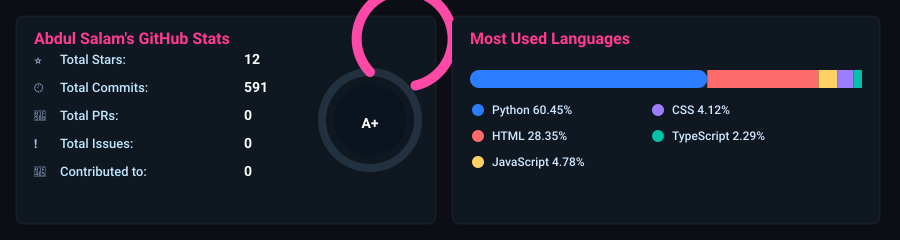

  

<h1 align="center">Hi, I'm Abdul Salam 👋</h1>

<b>Cybersecurity Student • Ethical Hacking • Penetration Testing • Secure Development</b>

I build practical cybersecurity tools and secure systems, with a strong focus on cryptography, network defense, and real-world security testing.

  
  
  
  

---

## 🚀 About Me

- 🎓 BS Computer Science student (Shaheed Benazir Bhutto University)
- 🔐 Focused on cybersecurity, ethical hacking, and secure software design
- 🧪 Building projects in NIDS, bot detection, and post-quantum secure communication
- 🛡 Active learner on TryHackMe and Hack The Box
- 🤝 Open to collaboration on cybersecurity open-source projects

---

## 🛠 Technical Skills

### 💻 Programming

### 🔐 Security & Tools

### ⚙️ Frameworks

---

## 🌟 Featured Projects

| Project | Description | Stack |
|---|---|---|
| [🛡️ Axiom](https://github.com/abdulsalam401/Axiom) | Advanced Android Security Assessment Framework | Security Testing |
| [📡 Network Intrusion Detection System](https://github.com/abdulsalam401/NID-System) | ML-powered intrusion detection for suspicious traffic | Python, Scapy, ML |
| [🔐 Quantum-Resilient Secure Communication](https://github.com/abdulsalam401/Quantum-Gem-FYP) | Hybrid secure communication using RSA + Kyber concepts | Django, Cryptography |
| [🤖 Athena Shield](https://github.com/abdulsalam401/Athena-Shield) | Intelligent bot detection with ML + honeypot ideas | Python, ML, Security |
| [🔒 Cryptic](https://github.com/abdulsalam401/Cryptic-Secure-Communication) | AES-based secure communication platform | Python, Crypto |
| [🔑 Secure Password Manager](https://github.com/abdulsalam401/Password-Manager-Chrome-Extension) | Encryption-based password manager concept | AES, Browser Security |

---

## 📚 Currently Learning

- Post-Quantum Cryptography
- Malware Analysis & Reverse Engineering
- Threat Intelligence & Digital Forensics
- Red Team / Blue Team Operations
- AI for Cybersecurity

---

## 🎯 2026 Goals

- Complete **100 Cybersecurity Projects Challenge**
- Publish more open-source security tools
- Contribute consistently to cybersecurity communities
- Earn advanced cybersecurity certifications
- Share educational security content

---

## 📊 GitHub Stats

  
  

  

<!-- Inserted by automation: aggregated language summary will be placed between these markers -->
<!--LANGUAGE_SUMMARY_START-->

## Aggregated language usage (including private repos)

| Language | Bytes | Percent |
|---|---:|---:|
| Python | 2,540,553 | 53.36% |
| HTML | 1,274,354 | 26.77% |
| JavaScript | 455,872 | 9.58% |
| CSS | 362,009 | 7.60% |
| TypeScript | 92,058 | 1.93% |
| Shell | 14,580 | 0.31% |
| PowerShell | 11,550 | 0.24% |
| YARA | 4,523 | 0.10% |
| C | 4,303 | 0.09% |
| Dockerfile | 864 | 0.02% |
| Batchfile | 219 | 0.00% |
| PHP | 49 | 0.00% |

_Total bytes counted: 4,760,934_

<!--LANGUAGE_SUMMARY_END-->

---

## 🐍 Contribution Snake

  

---

## 💬 Favorite Quote

> "Security isn't about breaking systems—it's about understanding them well enough to protect them."

---

## 📫 Contact

- 🌐 Portfolio: https://salamcs.app/
- 💼 LinkedIn: https://www.linkedin.com/in/abdul-salam-39467a274/
- 📧 Email: abdulsalam.cyber1@gmail.com

---

<b>⭐ Thanks for visiting my profile! Happy Coding & Ethical Hacking.</b>

  

