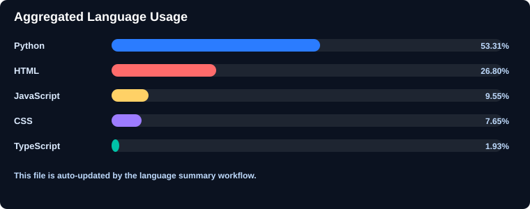

<p align="center">
  
</p>

<h1 align="center">Hi, I'm Abdul Salam 👋</h1>
<p align="center">
  <b>Cybersecurity Researcher • Ethical Hacker • Penetration Tester • Secure Systems Designer</b>
</p>

<p align="center">
  <i>"I build practical security tools — then try to break them before anyone else does."</i>
</p>

<p align="center">
  <a href="https://www.salamcs.tech/"></a>
  <a href="https://www.salamcs.app/"></a>
  <a href="https://www.linkedin.com/in/abdul-salam-39467a274/"></a>
  <a href="https://tryhackme.com/p/S4LAM"></a>
  <a href="https://app.hackthebox.com/public/users/3016111"></a>
  <a href="https://www.credly.com/users/abdulsalam401"></a>
  <a href="https://wa.me/923011909963?text=Hi%20Abdul%20Salam%2C%20I%20came%20across%20your%20GitHub!"></a>
  <a href="mailto:abdulsalam.cyber1@gmail.com"></a>
  <a href="https://drive.google.com/file/d/1wG_Awyyj5p9wvtPq7osdK4n0S7s6XZWb/view?usp=sharing"></a>
</p>

---

## ⚡ At a Glance

```text
  🛡️ Projects Built       :  51+ Security Projects & Practical Tools
  📜 Certifications       :  13+ Earned (Hackviser CORE, Google, Cisco, Red Team Leaders)
  🎓 Degree               :  BS in Computer Science (Shaheed Benazir Bhutto University)
  📍 Location             :  Islamabad, Pakistan
  🎯 Active Challenge     :  100 Ethical Hacking Projects Challenge (43+ Shipped)
```

---

## 🚀 About Me

I am a **Computer Science graduate** from **Shaheed Benazir Bhutto University Sheringal (SBBU)** with a specialized focus on **Cybersecurity, Cryptography, and Secure System Design**, currently based in **Islamabad, Pakistan**.

My work sits directly between research and the terminal:
- 🧪 **Hands-on Offensive & Defensive Security**: Engineering intrusion detection systems (NIDS), vulnerability scanners, post-quantum hybrid encryption engines, and Android security testing tooling.
- 🎯 **100 Ethical Hacking Projects Challenge**: Publicly building and shipping 100 focused cybersecurity builds across traffic analysis, vulnerability discovery, controlled malware simulation, forensics, and Sigma detection rules.
- ⚔️ **Practical Lab Experience**: Active practitioner on [TryHackMe (S4LAM)](https://tryhackme.com/p/S4LAM) and [Hack The Box](https://app.hackthebox.com/public/users/3016111).
- 🤝 **Collaboration & Opportunities**: Open to full-time cybersecurity roles, security engineering, penetration testing, research collaborations, and open-source contributions.

> **"Security isn't about breaking systems — it's about understanding them well enough to protect them."**

---

## 🛠 Technical Skills

<table>
  <tr>
    <td width="22%"><b>💻 Programming & Scripting</b></td>
    <td>
      
      
      
      
      
      
      
    </td>
  </tr>
  <tr>
    <td width="22%"><b>⚔️ Offensive Security</b></td>
    <td>
      
      
      
      
      
      
    </td>
  </tr>
  <tr>
    <td width="22%"><b>🛡️ Defensive & Core Security</b></td>
    <td>
      
      
      
      
      
      
    </td>
  </tr>
  <tr>
    <td width="22%"><b>🧰 Tools & Platforms</b></td>
    <td>
      
      
      
      
      
      
      
      
      
      
      
      
    </td>
  </tr>
  <tr>
    <td width="22%"><b>⚙️ Frameworks & Web</b></td>
    <td>
      
      
      
      
      
      
    </td>
  </tr>
</table>

---

## 🌟 Featured Projects

| Project | Description | Tech Stack | Links |
|:---|:---|:---|:---:|
| **🛡️ Network Intrusion Detection System (NIDS)** | Educational NIDS framework demonstrating complete IDS workflow: live packet sniffing with Scapy, Random Forest ML for traffic classification, and an interactive real-time dashboard. | Python, Scapy, Node.js, ML, Random Forest | [Code](https://github.com/abdulsalam401/NID-System) • [Live Demo](https://nids-project-demo-omega.vercel.app/) |
| **🔐 Quantum-Resilient Secure Communication** | Hybrid cryptographic model integrating RSA and Kyber (post-quantum lattice cryptography) with adaptive fallback and attack detection logic to safeguard against future quantum threats. | Python, Django, LibOQS, Kyber, RSA | [Code](https://github.com/abdulsalam401/Quantum-Gem-FYP) • [Live Demo](https://quantum-gem-fyp-bscs.vercel.app/) |
| **🤖 Athena Shield** | Research-grade bot and fraud mitigation platform employing behavioral biometrics, honeypot traps, browser fingerprinting, and ML classification to detect sophisticated automated actors. | Python, Machine Learning, Honeypots, Docker | [Code](https://github.com/abdulsalam401/Athena-Shield) |
| **📱 Axiom — Android Security Assessment** | Advanced Android assessment framework for ethical hackers: static APK decomposition, SDK CVE mapping, BlueZ Bluetooth HID injection, wireless ADB discovery, and real-time screen mirroring. | Python, ADB, Frida, Metasploit, Android | [Code](https://github.com/abdulsalam401/Axiom) |
| **🔍 PII-Scanner3 Reconnaissance Framework** | Full-scale bug bounty reconnaissance in one command: passive/active subdomain enum, WAF and origin mapping, endpoint discovery, GitHub dorking, and takeover checks with Rich TUI. | Python, OSINT, Rich TUI, DNS Recon | [Code](https://github.com/abdulsalam401/pii-scanner3) |
| **🔒 Cryptic Secure Communication** | Django-based cryptographic application implementing AES-256 in CBC mode for secure text/file encryption, cryptographic key/IV validation, PKCS7 padding, and encrypted download streams. | Python, Django, AES-256, CBC Mode, Cryptography | [Code](https://github.com/abdulsalam401/Cryptic-Secure-Communication) • [Live Demo](https://cryptic-secure-communication.vercel.app/) |
| **🧪 100 Ethical Hacking Projects Challenge** | A structured public challenge of 100 security builds (43 shipped so far) spanning packet capture, vulnerability assessment, controlled malware simulation, digital forensics, and Sigma rules. | Python, Scapy, Forensics, YARA, Network Defense | [Code](https://github.com/abdulsalam401/Ethical-Hacking-100-Projects-Challenge) |
| **🔑 Secure Password Manager** | Offline local password vault utilizing AES-128 + PBKDF2 encryption paired with a custom Chrome Extension for secure credential auto-fill via Native Messaging. | Python, AES, PBKDF2, Chrome Extension | [Code](https://github.com/abdulsalam401/Password-Manager-Chrome-Extension) |

---

## 📜 Certifications & Credentials

| Credential | Issuer | Issue Date | Verification |
|:---|:---|:---:|:---:|
| **Certified Cybersecurity Foundations (CORE)** | Hackviser | Sep 2026 | [Verify Credential](https://hackviser.com/verify?id=HV-CORE-Z7KI21YA) |
| **Google Cybersecurity Professional Certificate** | Google | Aug 2026 | [Verify Credential](https://coursera.org/verify/professional-cert/7L0FJ4UGRDTQ) |
| **Ethical Hacker** | Cisco Networking Academy | Jul 2026 | [Verify on Credly](https://www.credly.com/users/abdulsalam401) |
| **Certified Cybersecurity Educator Professional (CCEP)** | Red Team Leaders | Dec 2025 | Verified |
| **Introduction to Cybersecurity** | Cisco Networking Academy | Jul 2025 | [Verify on Credly](https://www.credly.com/users/abdulsalam401) |
| **Networking Basics** | Cisco Networking Academy | Jul 2025 | [Verify on Credly](https://www.credly.com/users/abdulsalam401) |
| **Python Essentials 1 & 2** | Cisco Networking Academy | Jul & Oct 2025 | [Verify on Credly](https://www.credly.com/users/abdulsalam401) |
| **Gemini Certified Student** | Google for Education | Nov 2025 | Verified |
| **Android Malware Analysis** | Udemy | Jul 2024 | Course Credential |
| **Ethical Hacking: Hacker Methodology** | Udemy | Jul 2024 | Course Credential |
| **TryHackMe Practical Challenges & Labs** | TryHackMe | 2026 | [Profile (S4LAM)](https://tryhackme.com/p/S4LAM) |

---

## 📚 Currently Researching & Exploring

- 🔒 **Post-Quantum Cryptography**: NIST post-quantum standards (ML-KEM/Kyber, ML-DSA/Dilithium) and hybrid cryptographic transition protocols.
- 🔬 **Malware Analysis & Reverse Engineering**: Dynamic sandbox analysis, static APK decompilation, and hooking with Frida.
- 🛡️ **SOC & Threat Intelligence**: SIEM rule engineering, Sigma detection rules, and incident handling workflows.
- 🤖 **AI-Augmented Security**: Applying Machine Learning to anomaly detection, bot mitigation, and automated threat hunting.

---

## 📊 GitHub Analytics & Streak

<div align="center">
  
  
</div>

---

## 🐍 Contribution Grid

<p align="center">
  
</p>

---

## 📫 Connect & Collaborate

- 🌐 **Primary Portfolio**: [salamcs.tech](https://www.salamcs.tech/)
- 💻 **Interactive Portfolio Web App**: [salamcs.app](https://www.salamcs.app/)
- 💼 **LinkedIn**: [linkedin.com/in/abdul-salam-39467a274](https://www.linkedin.com/in/abdul-salam-39467a274/)
- 📧 **Email**: [abdulsalam.cyber1@gmail.com](mailto:abdulsalam.cyber1@gmail.com)
- 💬 **WhatsApp**: [+92 301 1909963](https://wa.me/923011909963?text=Hi%20Abdul%20Salam%2C%20I%20came%20across%20your%20GitHub!)
- 🚩 **TryHackMe**: [tryhackme.com/p/S4LAM](https://tryhackme.com/p/S4LAM)
- 📦 **Hack The Box**: [profile.hackthebox.com](https://app.hackthebox.com/public/users/3016111)
- 🏅 **Credly**: [credly.com/users/abdulsalam401](https://www.credly.com/users/abdulsalam401)
- 📄 **Resume / CV**: [Google Drive Resume](https://drive.google.com/file/d/1wG_Awyyj5p9wvtPq7osdK4n0S7s6XZWb/view?usp=sharing)
- 🐦 **X (Twitter)**: [@abdulsalamyt72](https://x.com/abdulsalamyt72)

<p align="center">
  
</p>

<!--LANGUAGE_SUMMARY_START-->

## Aggregated language usage (including private repos)



| Language | Percent |
|---|---:|
| Python | 48.91% |
| HTML | 24.13% |
| JavaScript | 13.56% |
| CSS | 6.97% |
| TypeScript | 5.54% |
| Shell | 0.39% |
| PowerShell | 0.34% |
| YARA | 0.08% |
| C | 0.07% |
| Dockerfile | 0.01% |

_Total bytes counted: 5,910,441_

<!--LANGUAGE_SUMMARY_END-->
